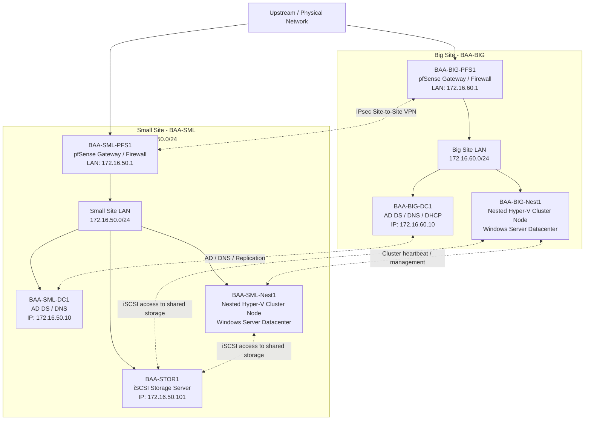
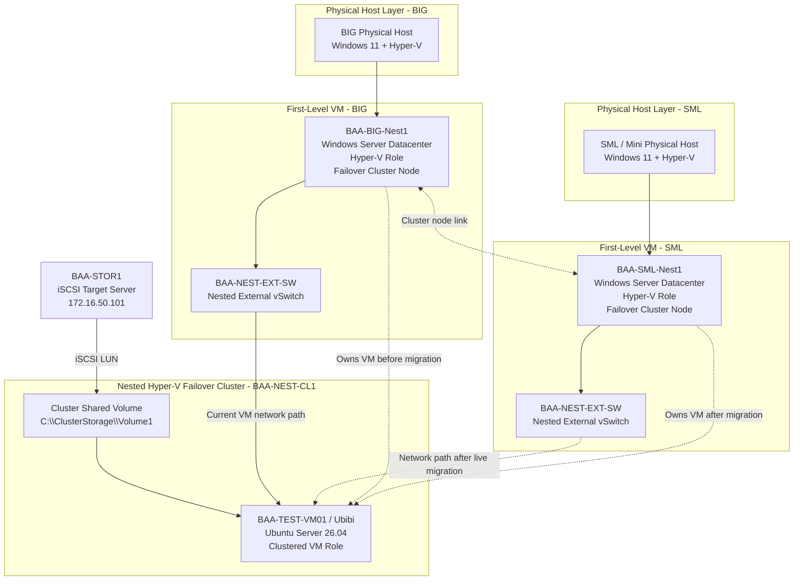

## Current Logical Topology



## Nested Hyper-V Cluster Extension



## Nested VM Current Troubleshooting State

```text
Current nested test VM:
BAA-TEST-VM01 / Ubibi

Guest OS:
Ubuntu Server 26.04

Current issue:
Ubibi has no usable IPv4 address yet.

Confirmed:
- `ip -4 addr` only shows loopback: 127.0.0.1/8
- SSH service is not installed yet
- Gateway 172.16.60.1 is not reachable from Ubibi

Next checks:
1. Run `ip link` inside Ubibi.
2. Verify BAA-TEST-VM01 has a VM network adapter.
3. Verify the adapter is connected to BAA-NEST-EXT-SW.
4. Verify BAA-NEST-EXT-SW is External on both nested Hyper-V nodes.
5. Verify MAC spoofing is enabled on BAA-BIG-Nest1 and BAA-SML-Nest1 from the physical Hyper-V hosts.
```